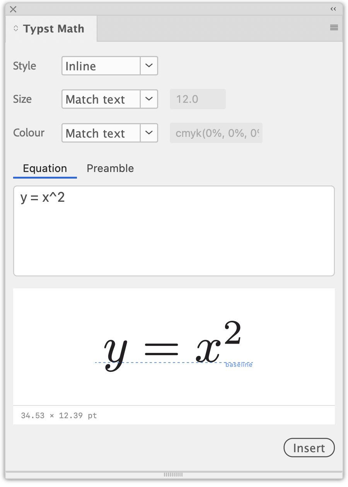

# Typst Math for InDesign

**Write a maths expression in [Typst](https://typst.app), watch it render, and
drop it into your document — where it stays editable.**

<p align="center">
  
</p>

Equations go in as **anchored objects** that sit correctly on the baseline, in
the point size and colour of the text around them. Select one later and the panel
loads its source back, so an equation is never a picture you have to redraw.

Typst compiles inside the panel, in WebAssembly. There is nothing to install
alongside it — no `typst` binary, no LaTeX, no internet connection.

---

## Install

1. Download **`indesign-typst-<version>.ccx`** from the
   [latest release](../../releases/latest).
2. Double-click it. Creative Cloud asks you to confirm an install from outside
   its Marketplace — this plugin is not distributed through Adobe, so that
   dialog is expected — and then installs it.
3. The panel is under **Plug-Ins ▸ Typst Math**. If it is not there, restart
   InDesign.

Needs InDesign 2026 (21.4.1 or newer). The download is around 25 MB, most of it
the Typst compiler; nothing else is fetched at any point.

If Creative Cloud will not take the `.ccx`, the plugin can also be loaded from a
clone of this repository through
[UXP Developer Tools](https://developer.adobe.com/photoshop/uxp/2022/guides/devtool/)
— see [docs/development.md](docs/development.md).

## Your first equation

Put the text cursor where the equation should go, then type into the panel:

```
sum_(i=1)^n x_i / 2
```

Type the **body** of the maths, not the `$…$` around it — though pasting the
`$…$` form works too. The preview updates as you type and draws a dashed guide
showing where the maths baseline will land.

Press **Insert** (or `Cmd/Ctrl+Enter`).

With a text cursor, the equation is anchored **inline**: it flows with the text,
and InDesign takes over line breaking, justification and leading from there.
Without one it lands as a frame on the page instead — and the panel says so,
since that is otherwise easy to miss.

New to Typst's maths syntax? The [Typst math reference](https://typst.app/docs/reference/math/)
is the place to look — `alpha`, `x^2`, `a/b`, `sum_(i=1)^n`, `mat(1, 2; 3, 4)`,
`cases(..)` all work as they do there.

## The controls

| Control | What it does |
| --- | --- |
| **Style** | `Inline` sits on the baseline of the line it is in. `Display` anchors above the line and centres it. |
| **Size** | `Match text` reads the point size at the cursor. `Fixed` uses the value you set. |
| **Colour** | `Match text` reads the fill of the text at the cursor, CMYK values included. `Fixed` takes a Typst colour of your own — `black`, `red`, `rgb("#cc0000")`, `cmyk(0%, 100%, 100%, 0%)`, or anything your preamble names. |

On **Match text** the box beside the menu is a readout, not an input. It shows
what was found at the cursor — `24`, `cmyk(0%, 0%, 0%, 100%)` — which is what the
next insert will use. Switching that control to **Fixed** keeps the value it is
showing, so matching the text and then nudging it is two clicks rather than a
retype.

### The Preamble tab

A Typst prelude shared by every equation in **this document** — `#let` macros,
`#set text(font: …)`, `#show` rules. Edit it with the preview live, since that is
exactly when you want to see what a macro does.

```typst
#let vv(x) = bold(upright(x))
#set text(font: "STIX Two Math")
```

It belongs to the document, not to you, so a `.indd` sent to a colleague still
renders identically. A **●** on the tab means this document carries one. Your
personal default preamble only *seeds* a document that has never had one —
**Save as default** promotes what you are looking at to that default, and
**Reset to default** puts it back.

## Editing an equation

Select an equation in the document and the panel loads its source; the button
becomes **Update**. Updating re-renders into the same frame, so its anchor point
in the text never moves.

The source and its settings ride along on the frame itself, which means they
survive saving, closing, and copy/paste — a pasted duplicate is editable too.

## Settings

The panel's flyout menu (**≡**, top right) has **Settings…**, **Re-render all in
document** and **About Typst Math**.

| Setting | What it is |
| --- | --- |
| **Fonts** | Extra `.otf`/`.ttf` files handed to the compiler, so maths can match a document set in something other than Typst's defaults. Per user. |
| **Default preamble** | Seeds any document that has never had one. Per user. |
| **New equations start as** | The style, size and colour a fresh equation opens with, instead of resetting each time the panel reloads. Per user. |
| **Re-render all** | Recompiles every equation in the document — see below. |

## Keeping equations in step with the text

InDesign will not scale an anchored frame with the surrounding type, and it
cannot recolour placed vector artwork. So point size and colour are baked into
each equation when it is rendered, which means restyling body text afterwards
leaves the maths behind.

**Re-render all** is the fix: every equation recorded as `Match text` re-reads
the size and colour of the text it is anchored in, so the pass behaves as a sync
rather than a plain recompile. Worth running after a stylesheet change, or before
sending a file out.

## Good to know

- **`#import "@preview/…"` packages do not resolve.** The compiler has no package
  registry wired up. Local `#let` macros and `#set`/`#show` rules in the preamble
  all work.
- **Adobe Fonts cannot be added as font files** — they are not readable as
  ordinary fonts on disk. Fonts installed normally on your system are fine.
- **Equations are re-rendered, never edited as vectors.** The Typst source on the
  frame is always the source of truth; changes made to the artwork with
  InDesign's own tools are lost on the next update.
- The artwork is embedded, so a document carries no link to anything of ours.

## Under the hood

- [docs/internals.md](docs/internals.md) — how an equation gets from the panel
  into the document: the baseline measurement that makes inline anchoring work,
  the WebAssembly compiler, the preview.
- [docs/development.md](docs/development.md) — running from source, the checks,
  packaging and releases.
- [CLAUDE.md](CLAUDE.md) — the UXP and InDesign traps met along the way, each one
  measured rather than assumed.

## License

[MIT](LICENSE). The compiler it ships with —
[typst.ts](https://github.com/Myriad-Dreamin/typst.ts), tracking Typst 0.14.2 —
and Adobe's Spectrum design tokens are Apache-2.0, and travel inside the `.ccx`
under their own terms; the installed plugin lists them in
`vendor/licenses/THIRD-PARTY.md`, with the licence text beside it.
